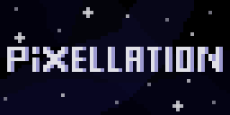

# Disclaimer: This program is highly in development!

## About

Pixellation is a pixel art editor program developed in .NET Core. It provides features like tiling and layer management with grouping.

## Development, planned features (this can change in the future / during development):

### Milestone 1
- [x] Basic, in-dev UI
- [x] Basic features: Choosing colors.
- [x] Basic features: Drawing pixels (1x1).
- [x] Saving in common formats like png or jpeg.
- [x] Preview

### Milestone 2
- [x] Basic layers, add, remove
- [x] Rectangle tool, sphere tool
- [x] Tools for one pixel drawing, dithering, drawing lines, pipette, eraser, paintbucket fill
- [x] Application icon
- [x] Loading image files to edit

### Milestone 3
- [x] Transparency for layers
- [x] Tiling
- [x] Draw tool previews *(eg. see the line to be drawn before applied)*
- [x] Ordering, managing layers

### Milestone 4
- [x] Own filetype for projects
- [x] Save & Load Projects
- [x] More Advanced Colourpalette

### Milestone 5
- [x] Mirror layer(s)
- [x] Rotate layer(s) *(by 90°)* (counter)clockwise
- [ ] Selecting parts of image, cutting, pasting it

### Milestone 6

- [ ] Blending mode for layers
- [ ] Blending mode for brushes
- [ ] Transparency for brushes

### Milestone 7
- [ ] Layergroups

### After Release
- [ ] Sprite animation
